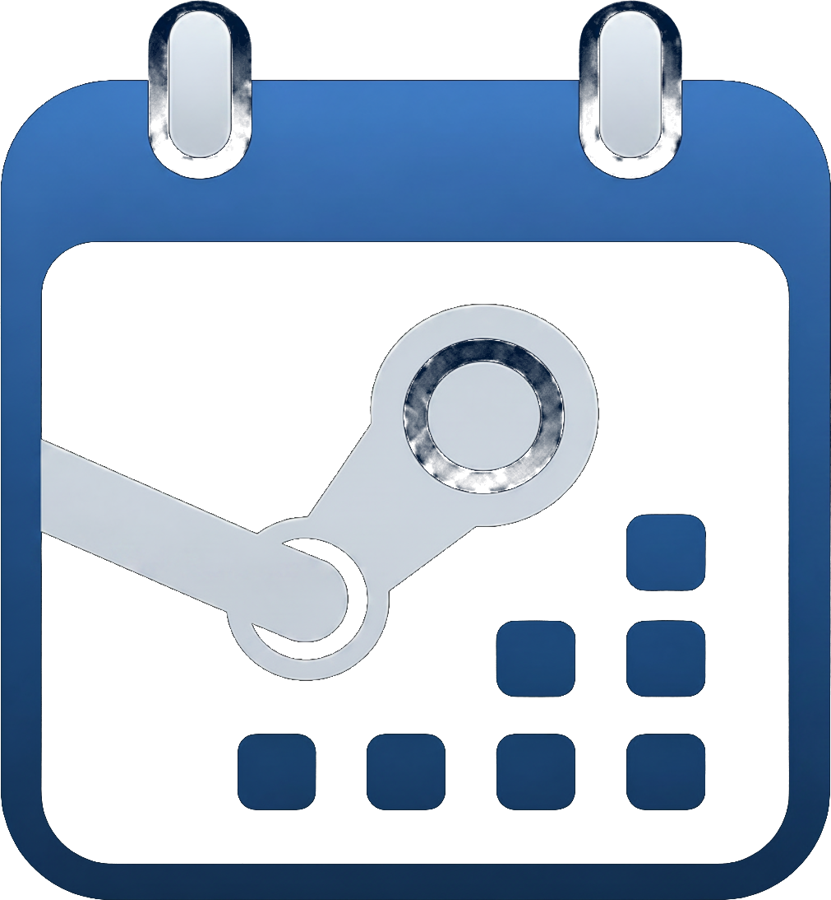
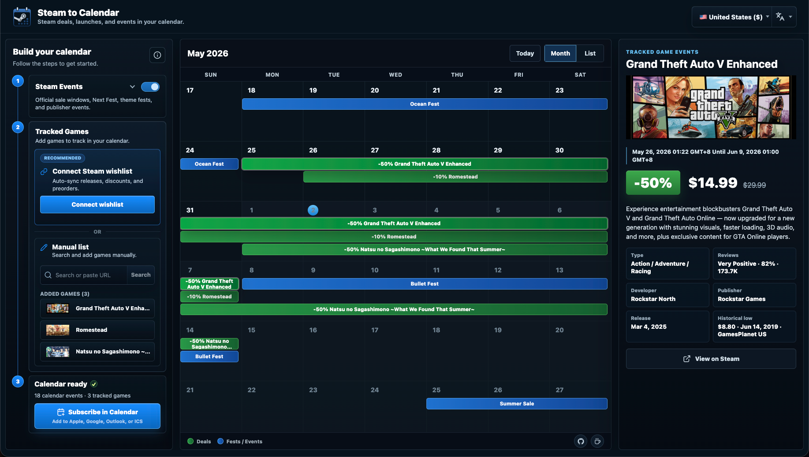
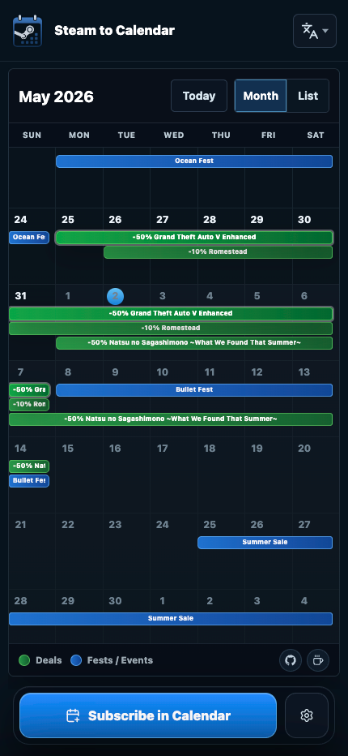

<p align="center">
  
</p>

<h1 align="center">Steam to Calendar</h1>

<p align="center">
  Track Steam deals, game launch dates, wishlist releases, and official Steam events in your calendar.
</p>

<p align="center">
  <a href="README.zh-CN.md">中文文档</a>
  ·
  <a href="https://steamcalendar.com/">Open App</a>
  ·
  <a href="https://blog.nickxu.me/steam-to-calendar/">Read the Blog</a>
</p>

Steam to Calendar turns Steam sales, game launches, preorders, wishlist updates, and official Steam events into a calendar you can subscribe to. Pick the games and event types you care about, preview the result, then add the generated feed to Apple Calendar, Google Calendar, Outlook, Fantastical, or any ICS/WebCal-compatible calendar app.

It works with public Steam data by default, so you can run it locally without accounts, tokens, or paid APIs. Optional IsThereAnyDeal enrichment adds deeper price-history context when you provide an API key.

> Steam to Calendar is not affiliated with Valve Corp. Steam, Valve, and related marks belong to their respective owners.

## Preview

Desktop workbench:



Mobile calendar builder:

<p align="center">
  
</p>

## What It Does

- Builds subscribable ICS/WebCal feeds for Steam events, selected games, and public wishlists.
- Tracks official sale windows, Next Fest, theme festivals, publisher sales, franchise events, releases, preorders, and discounts.
- Lets you connect a public wishlist or curate a smaller manual watch list.
- Shows an interactive desktop and mobile preview before you subscribe.
- Supports independent Steam store region and interface language settings.
- Encodes feed configuration in the calendar URL, making feeds easy to share, inspect, and resubscribe to.
- Runs on public Steam data by default, with optional advanced price-history enrichment.

## Optional Price History

Steam to Calendar does not require a third-party API key. Without one, it uses public Steam data and still generates previews and calendar feeds.

For richer historical-low and price-window data, create an IsThereAnyDeal API key at <https://isthereanydeal.com/apps/> and set:

```bash
STEAM_CLI_ITAD_KEY=your_key
```

See the [Steam CLI README](https://github.com/nickxudotme/steam-cli#advanced-price-enhancement) for the underlying enrichment behavior.

## Quick Start

```bash
npm install
cp .env.example .env.local
npm run build:steam-cli
npm run dev
```

`npm run dev` uses the webpack dev server. `npm run dev:turbopack` is available for checking Turbopack behavior, but webpack is the default local workflow for this app.

If local Next.js dev state gets strange, clear only the dev cache:

```bash
npm run dev:clean
```

Then open <http://localhost:3000>.

## Configuration

Common environment variables:

| Variable                            | Required | Description                                                                   |
| ----------------------------------- | -------- | ----------------------------------------------------------------------------- |
| `STEAM_CLI_PATH`                    | No       | Path to the Steam CLI binary. Defaults to `bin/steam-cli` when built locally. |
| `STEAM_CLI_ITAD_KEY`                | No       | Optional IsThereAnyDeal API key for advanced price-history enrichment.        |
| `STEAM_CLI_CC`                      | No       | Default Steam store country/region code, such as `US`, `CN`, or `JP`.         |
| `STEAM_CLI_LANG`                    | No       | Default Steam content language, such as `english` or `schinese`.              |
| `STEAM_CLI_UI_LANG`                 | No       | Default Steam CLI interface language, such as `en` or `zh-CN`.                |
| `STEAM_CLI_CACHE_MAX_ENTRIES`       | No       | Maximum in-memory Steam CLI cache entries.                                    |
| `STEAM_CLI_CACHE_STALE_TTL_MS`      | No       | How long stale successful CLI responses may be reused after refresh failures. |
| `STEAM_CALENDAR_WATCHED_APP_BUDGET` | No       | Maximum watched-app lookups per calendar request.                             |

See [.env.example](.env.example) for the full local-development template.

## Observability

Production analytics are sent to the self-hosted Umami instance at
<https://umami.nickxu.me>.

- Client page views and custom events use `NEXT_PUBLIC_UMAMI_SCRIPT_URL` and
  `NEXT_PUBLIC_UMAMI_WEBSITE_ID`.
- Session replays use `NEXT_PUBLIC_UMAMI_RECORDER_URL`; they are enabled by
  default at a `1.0` sample rate while traffic is low, mask inputs, stop after 5 minutes, and block
  the manual subscription URL area from recordings.
- Localhost analytics are disabled by default to keep local QA sessions out of
  the production Umami website. Set `NEXT_PUBLIC_UMAMI_ALLOW_LOCALHOST=1` only
  when intentionally testing Umami locally.
- Server-side diagnostic events use `UMAMI_COLLECT_URL` and `UMAMI_WEBSITE_ID`.
- The current Steam to Calendar website ID is
  `312a5b89-c994-4d81-a96b-63239f4fdbf0`.
- Raw search or wishlist inputs stay disabled unless the explicit debug capture
  flags are enabled.
- Client preview timing events record public preview start, completion, failure,
  and duration without recording raw search or wishlist inputs.
- Umami keeps session replays for 30 days.

For local operations reports against the self-hosted Umami instance, set
`UMAMI_USERNAME` and `UMAMI_PASSWORD` in `.env.local`; the script logs in through
`/api/auth/login` and then uses Bearer auth. `UMAMI_API_KEY` is still supported
for Umami Cloud-style API keys. The API endpoint defaults to
`https://umami.nickxu.me/api`.

## Scripts

```bash
npm run dev              # Start Next.js with webpack
npm run dev:clean        # Clear .next/dev
npm run build:steam-cli  # Build vendor/steam-cli into bin/steam-cli
npm run build            # Production build; builds Steam CLI first
npm run start            # Start the production server
npm run verify           # Format, lint, typecheck, unit tests, build
npm run verify:full      # verify + stable Playwright e2e
npm run test:e2e:live    # Live Steam smoke tests
npm run ops:today        # Deployment and Umami activity summary
```

Production builds run `build:steam-cli` automatically. If you intentionally want to skip rebuilding the binary during local checks, set:

```bash
SKIP_STEAM_CLI_BUILD=1 npm run build
```

## Architecture

```text
src/
  app/                  App Router pages and route handlers
  features/             Product workflows and UI
  domain/               Calendar rules and ICS mapping
  integrations/         Steam adapters, parsing, cache, and fallbacks
  server/               Request orchestration and HTTP responses
  shared/               Shared contracts and runtime validators

vendor/steam-cli/       Vendored Steam CLI
public/assets/brand/    Logo and app icons
```

The codebase keeps product, domain, integration, and server concerns separated:

- `src/app` contains route handlers, layouts, and page shells.
- `src/features/calendar-builder` owns the interactive calendar builder experience.
- `src/domain/calendar` owns feed configuration, event mapping, and ICS output.
- `src/integrations/steam` owns Steam CLI/API calls, parsing, caching, and fallbacks.
- `src/server/calendar` composes domain and integration code for HTTP/API responses.
- `src/shared` contains DTOs and validators shared by the browser and server.

## Testing

```bash
npm run format:check
npm run lint
npm run typecheck
npm test
npm run build
```

For full confidence:

```bash
npm run verify:full
```

Testing approach:

- Unit tests cover calendar mapping, ICS generation, Steam parsing, cache behavior, route contracts, and response builders.
- Default Playwright tests use mocked Steam responses so CI remains deterministic.
- Live Steam smoke tests are separate because real Steam data and network state can change:

```bash
npm run test:e2e:live
```

## Data Sources

Steam to Calendar uses the vendored [Steam CLI](https://github.com/nickxudotme/steam-cli) for Steam access. Steam CLI combines public Steam Store, Steam Community, Steam Web API, Steamworks event pages, and optional IsThereAnyDeal enrichment.

Default mode is public, live, and API-key-free. Advanced pricing requires `STEAM_CLI_ITAD_KEY`.

## Contributing

Issues and pull requests are welcome. Before opening a PR, run:

```bash
npm run verify
```

For UI changes, also run the relevant Playwright tests and manually check both desktop and mobile layouts.
