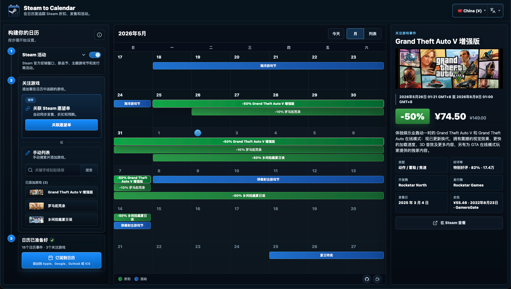
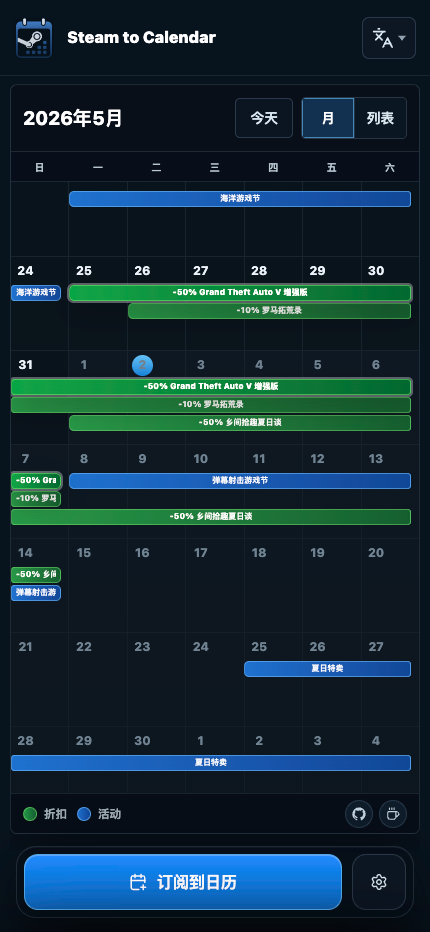

<p align="center">
  
</p>

<h1 align="center">Steam to Calendar</h1>

<p align="center">
  在系统日历里追踪 Steam 折扣、游戏发售日、愿望单和官方活动。
</p>

<p align="center">
  <a href="README.md">English README</a>
  ·
  <a href="https://steamcalendar.com/">打开官网</a>
</p>

Steam to Calendar 可以把 Steam 折扣、游戏发售、预购、愿望单更新和官方活动变成可订阅的日历。选择你关心的游戏和事件类型，先在页面里预览效果，再订阅到 Apple Calendar、Google Calendar、Outlook、Fantastical 或任何支持 ICS/WebCal 的日历应用。

默认情况下，它只依赖公开 Steam 数据，本地运行不需要账号、token 或付费 API。配置 IsThereAnyDeal API key 后，可以额外显示更完整的价格历史和史低信息。

> Steam to Calendar 与 Valve Corp. 没有关联。Steam、Valve 以及相关标识归各自权利方所有。

## 预览

桌面端工作台：



移动端日历构建器：

<p align="center">
  
</p>

## 可以做什么

- 为 Steam 活动、关注游戏和公开愿望单生成可订阅的 ICS/WebCal feed。
- 追踪官方促销窗口、Next Fest、主题游戏节、发行商促销、系列促销、发售、预购和折扣。
- 支持连接公开愿望单，也支持手动维护一个更小的关注列表。
- 在订阅前提供桌面端和移动端交互预览。
- 支持独立选择 Steam 商店地区和界面语言。
- 把 feed 配置编码在日历 URL 中，方便分享、检查和重新订阅。
- 默认使用公开 Steam 数据，也可以通过 API key 增强价格历史。

## 可选价格历史

Steam to Calendar 不依赖第三方 API key。没有 API key 时，它会使用公开 Steam 数据，并照常生成预览和日历 feed。

如果想获得更完整的史低和价格窗口数据，可以在 <https://isthereanydeal.com/apps/> 创建 IsThereAnyDeal API key，然后设置：

```bash
STEAM_CLI_ITAD_KEY=your_key
```

底层增强逻辑可以参考 [Steam CLI README](https://github.com/nickxudotme/steam-cli#advanced-price-enhancement)。

## 快速开始

```bash
npm install
cp .env.example .env.local
npm run build:steam-cli
npm run dev
```

`npm run dev` 默认使用 webpack dev server。`npm run dev:turbopack` 可以用来检查 Turbopack 行为，但当前本地开发默认走 webpack。

如果本地 Next.js dev 状态变得奇怪，可以只清理 dev cache：

```bash
npm run dev:clean
```

然后打开 <http://localhost:3000>。

## 配置

常用环境变量：

| 变量                                | 必填 | 说明                                                     |
| ----------------------------------- | ---- | -------------------------------------------------------- |
| `STEAM_CLI_PATH`                    | 否   | Steam CLI 二进制路径。本地构建后通常是 `bin/steam-cli`。 |
| `STEAM_CLI_ITAD_KEY`                | 否   | 可选 IsThereAnyDeal API key，用于高级价格历史增强。      |
| `STEAM_CLI_CC`                      | 否   | 默认 Steam 商店地区代码，例如 `US`、`CN`、`JP`。         |
| `STEAM_CLI_LANG`                    | 否   | 默认 Steam 内容语言，例如 `english` 或 `schinese`。      |
| `STEAM_CLI_UI_LANG`                 | 否   | 默认 Steam CLI 界面语言，例如 `en` 或 `zh-CN`。          |
| `STEAM_CLI_CACHE_MAX_ENTRIES`       | 否   | Steam CLI 内存缓存最大条目数。                           |
| `STEAM_CLI_CACHE_STALE_TTL_MS`      | 否   | CLI 刷新失败后，可继续使用过期成功响应的时间。           |
| `STEAM_CALENDAR_WATCHED_APP_BUDGET` | 否   | 单个日历请求最多查询多少个关注游戏。                     |

完整本地模板见 [.env.example](.env.example)。

## 脚本

```bash
npm run dev              # 使用 webpack 启动 Next.js
npm run dev:clean        # 清理 .next/dev
npm run build:steam-cli  # 把 vendor/steam-cli 构建到 bin/steam-cli
npm run build            # 生产构建；会先构建 Steam CLI
npm run start            # 启动生产服务
npm run verify           # format、lint、typecheck、unit test、build
npm run verify:full      # verify + 稳定 Playwright e2e
npm run test:e2e:live    # 真实 Steam smoke test
```

生产构建会自动运行 `build:steam-cli`。如果你只是本地检查并明确想跳过二进制重建，可以使用：

```bash
SKIP_STEAM_CLI_BUILD=1 npm run build
```

## 架构

```text
src/
  app/                  App Router 页面和 route handlers
  features/             产品工作流和 UI
  domain/               日历规则和 ICS 映射
  integrations/         Steam adapter、解析、缓存和降级
  server/               请求编排和 HTTP 响应
  shared/               共享合同和运行时校验器

vendor/steam-cli/       vendored Steam CLI
public/assets/brand/    Logo 和应用图标
```

代码按产品、领域、集成和服务端职责拆分：

- `src/app` 放 route handlers、layout 和页面壳。
- `src/features/calendar-builder` 负责交互式日历构建体验。
- `src/domain/calendar` 负责 feed 配置、事件映射和 ICS 输出。
- `src/integrations/steam` 负责 Steam CLI/API 调用、解析、缓存和降级。
- `src/server/calendar` 组合领域逻辑和 Steam 集成，生成 HTTP/API 响应。
- `src/shared` 放浏览器和服务端共享的 DTO 与校验器。

## 测试

```bash
npm run format:check
npm run lint
npm run typecheck
npm test
npm run build
```

需要完整信心时：

```bash
npm run verify:full
```

测试策略：

- 单测覆盖日历映射、ICS 生成、Steam 解析、缓存行为、route contract 和响应构建。
- 默认 Playwright 测试使用 mocked Steam 响应，让 CI 保持确定性。
- 真实 Steam smoke test 单独运行，因为 Steam 数据和网络状态会变化：

```bash
npm run test:e2e:live
```

## 数据来源

Steam to Calendar 通过 vendored [Steam CLI](https://github.com/nickxudotme/steam-cli) 访问 Steam。Steam CLI 会组合公开 Steam Store、Steam Community、Steam Web API、Steamworks 活动页面，以及可选 IsThereAnyDeal 增强。

默认模式公开、实时、无需 API key。高级价格能力需要设置 `STEAM_CLI_ITAD_KEY`。

## 参与贡献

欢迎提交 issue 和 pull request。提交 PR 前建议运行：

```bash
npm run verify
```

如果是 UI 变更，也请运行相关 Playwright 测试，并手动检查桌面和移动端布局。
